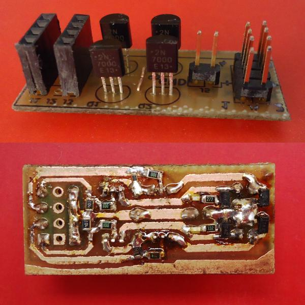

 
##Fan extension board for RAMPS##
This extension allows you to connect additional 4 fans into RAMPS board (plugged into servo pins). Board is single sided and was designed for home etching, uses THT and SMD soldering components. Make sure board dimensions (16x40mm) are not colliding with your actual setup. NPN transistors can be used as well instead of FET's. Voltage above 5V is provided by additional connector plug, reversed polarity may destory electronics.
Configuration process is similar to other boards, example [here](https://www.geeetech.com/wiki/index.php/Reprap_Ramps1.4_RRD_Fan_Extender), use pins 11, 6, 5 or 4. Made with KiCAD.

